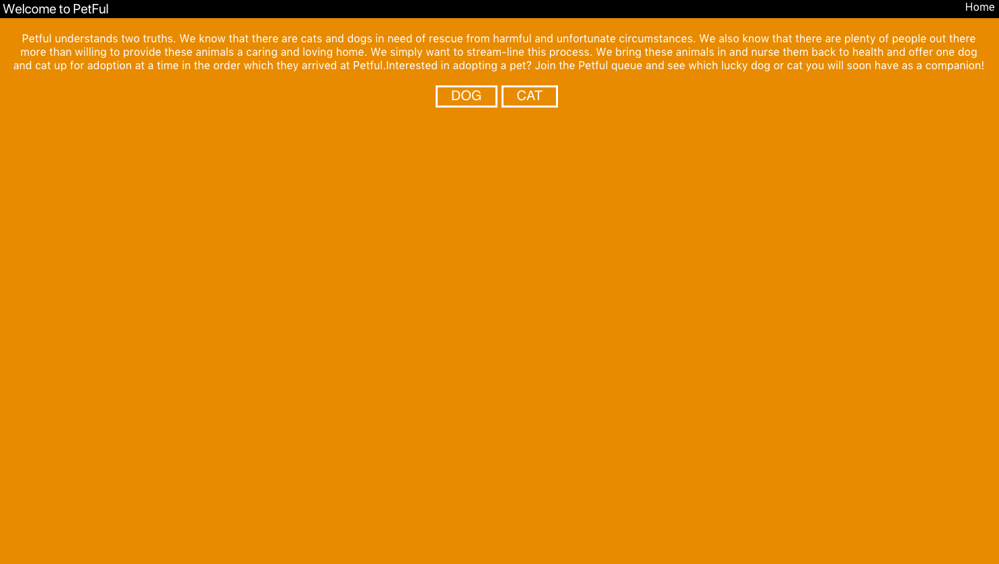

# Petful

## Introduction

Petful understands two truths. We know that there are cats and dogs in need of rescue from harmful and unfortunate circumstances. We also know that there are plenty of people outhere more than willing to provide thesanimals a caring and loving home. Wsimply want to stream-line this process.
We bring these animals in and nurse theback to health and offer one dog and caup for adoption at a time in the ordewhich they arrived at Petful.Interested in
adopting a pet? Join the Petful queue ansee which lucky dog or cat you will soohave as a companion!

## Contributors
 [Jizong Liang](https://github.com/JizongL) & [Enrique Montemayor](https://github.com/eemontemayor)

Checkout the [Petful live here](https://jizong-enricque-petful-app.2015rpro.now.sh/)

Checkout the [Server Github here](https://github.com/thinkful-ei-bee/DSA-Petful-Jizong-Enrique-server)

### technologies
This app utilizes HTML, CSS, React, Node, Express
